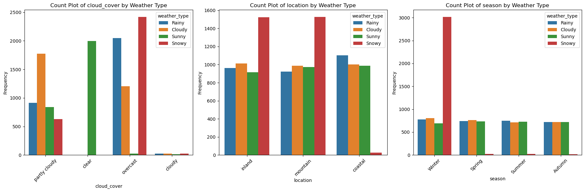
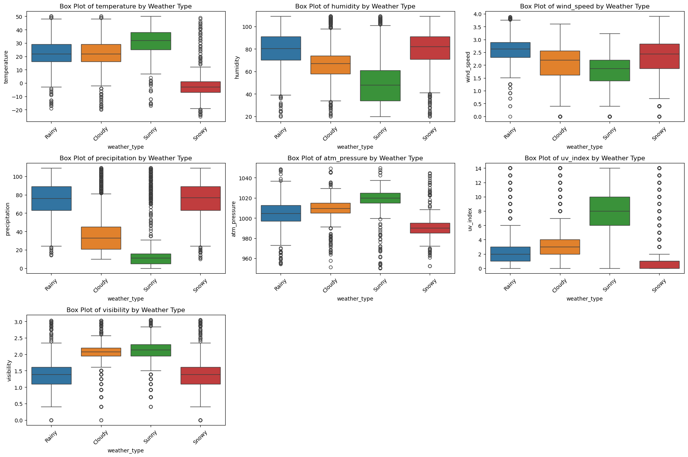
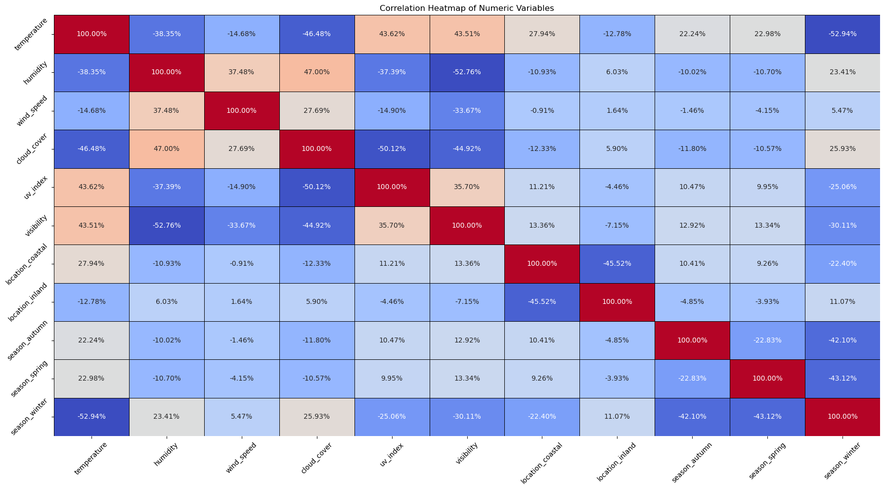
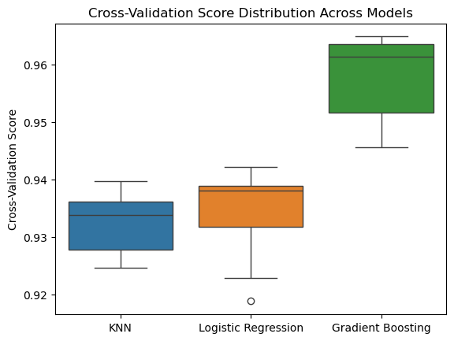

# Weather Type Classification Project

  

## Project Overview
This project utilizes the [Weather Type Classification Dataset](https://www.kaggle.com/datasets/nikhil7280/weather-type-classification) from Kaggle to analyze and predict **Weather Types** based on various meteorological variables. The aim is to develop classification models that accurately categorize weather as **Rainy**, **Sunny**, **Cloudy**, or **Snowy**, while also uncovering the most influential features driving these classifications.

## Problem Statement
Accurate weather classification plays a vital role in meteorological forecasting, planning, and decision-making across various sectors. However, noisy or extreme readings can challenge model accuracy. This project explores how different weather-related attributes contribute to weather type predictions and builds machine learning models capable of classifying them with high reliability. The objective is to better understand these patterns and support accurate, automated weather categorization systems.

## Dataset Overview
The dataset contains **13,200 rows** and **11 columns**, all synthetically generated to simulate real-world variability. After cleaning and preprocessing, the dataset is used for both exploratory and predictive analysis. Key attributes include:

1. **Temperature** – Measures temperature in Celsius, covering a wide range of realistic and extreme conditions  
2. **Humidity** – Percentage humidity, includes values >100% to simulate data irregularities  
3. **Wind Speed** – Wind speed in km/h, including unusually high values to introduce outliers  
4. **Precipitation (%)** – Simulated rainfall/snowfall percentage  
5. **Cloud Cover** – Categorical description of cloud intensity  
6. **Atmospheric Pressure** – Pressure values in hPa  
7. **UV Index** – Intensity of ultraviolet radiation  
8. **Season** – Categorical label for the season (Winter, Summer, etc.)  
9. **Visibility (km)** – Clarity of view in kilometers  
10. **Location** – Type of location (e.g., Coastal, Inland)  
11. **Weather Type** – Target variable: **Rainy**, **Sunny**, **Cloudy**, or **Snowy**

> ⚠️ *Note*: While the data is synthetic, it provides a valuable opportunity to apply and practice preprocessing, classification modeling, and performance evaluation in a real-world style context. This project showcases how machine learning can be used effectively to classify weather conditions and demonstrates best practices in handling synthetic yet complex datasets.

## Project Goals
1. **Data Analysis** – Perform exploratory data analysis (EDA) to detect trends, outliers, and patterns in weather data  
2. **Feature Engineering** – Clean and transform features to improve model accuracy  
3. **Model Building** – Develop, evaluate, and compare classification models to predict weather type  
4. **Model Interpretation** – Use confusion matrix and feature importance to understand model behavior  

## Links to Notebooks

* **Step 1: Data Wrangling**
  `01_data_wrangling.ipynb` – Cleans, deduplicates, and renames columns. Feature engineering and data inspection are also covered.
  🔗 [View Notebook](./01_data_wrangling.ipynb)

* **Step 2: EDA – Visualization**
  `02_eda_visualization.ipynb` – Uses plots and charts to explore relationships between academic, soft skill, and placement factors.
  🔗 [View Notebook](./02_eda_visualization.ipynb)

* **Step 3: EDA – SQL Queries**
  `03_eda_sql_queries.ipynb` – SQL analysis for summarizing numerical trends across placement groups.
  🔗 [View Notebook](./03_eda_sql_queries.ipynb)

* **Step 4: Modeling & Prediction**
  `04_modeling_prediction.ipynb` – Builds machine learning models to predict Placement Status using the prepared dataset.
  🔗 [View Notebook](./04_modeling_prediction.ipynb)

## Section Summaries

### Step 1: Data Wrangling & Cleaning

We began with 13,200 rows and 11 columns of weather data. Extreme values in temperature, atmospheric pressure, and wind speed were removed for cleaner analysis. The dataset had no missing or duplicate values. Key variables were evaluated for ranges and averages, revealing skewed distributions for some (like visibility and wind speed), prompting transformations. Categorical variables like season and cloud cover were noted for imbalances, with winter and overcast being the most common.

### Step 2: Exploratory Data Analysis (EDA)

Visual analysis showed clear patterns. Cloud Cover, Season, and Location influenced Weather Types significantly e.g., Snowy conditions align with overcast skies and winter. Temperature showed a multimodal pattern, while humidity followed a bell curve. Features like wind speed and visibility were skewed and improved with log transformations. Relationships between features highlighted that weather types are shaped by combinations of temperature, precipitation, cloud cover, and seasonality.

  

This visual summarizes how Cloud Cover, Season, and Location relate to Weather Type. Overcast skies and winter months are clearly linked to snowy conditions, while clear skies dominate sunny days. Mountainous areas also show more snowy weather. This chart effectively displays how categorical features influence classification.

  

Boxplots show the distribution of features like temperature, humidity, and UV index for each weather type. Sunny weather has the highest temperatures and UV levels; snowy days are coldest with lowest visibility. Rainy conditions show the most precipitation and wind speed. These visuals highlight the numeric profiles of each class.

  

This heatmap displays relationships among all features. Strong positive correlations exist between humidity and precipitation, temperature and pressure. Strong negative links are seen between cloud cover and visibility, and temperature and winter season. It helps identify which variables are most influential for modeling weather patterns.

### Step 3: SQL-Based Analysis

Using SQL, we identified how weather characteristics varied across categories. Snowy weather, most frequent in winter, correlated with the lowest visibility. Spring had the highest temperature, while winter had the most precipitation. Rainy weather was windiest, and coastal areas recorded the highest UV levels. This structured querying confirmed patterns seen in visual EDA, enhancing our understanding of atmospheric behaviors across geography and time.

### Step 4: Modeling and Hyperparameter Tuning

After preprocessing and feature encoding, we tested three models: Gradient Boosting, Logistic Regression, and K-Nearest Neighbors. Gradient Boosting achieved the highest accuracy (95.35%) and outperformed others in F1-scores for all weather types. It showed the best balance of precision and recall, especially for Snowy and Sunny classes. While Logistic Regression and KNN also performed well, GB proved most stable and generalizable after cross-validation and error analysis.

  

This boxplot visualizes the cross-validation score distributions for the three models used: KNN, Logistic Regression, and Gradient Boosting. It clearly shows that Gradient Boosting not only achieved the highest average score but also exhibited the least variation, indicating superior and consistent performance across all folds.

  

The confusion matrix image visually displays how well the Gradient Boosting Classifier predicted each weather class. The diagonal cells show a high number of correct predictions for Snowy, Cloudy, Rainy, and Sunny classes, while the off-diagonal cells reveal only a few misclassifications. This highlights the model’s strong accuracy and low error rate across all classes.

  

The feature importance plot shows which input variables had the greatest influence on the model’s predictions. Temperature stands out as the most important factor, followed by UV Index, Visibility, and Cloud Cover. Less influential features like Season and Location are also shown, emphasizing the dominant role of direct weather measurements in the model’s decision-making.

### Model Comparison

In evaluating the performance of the three models—Gradient Boosting Classifier, Logistic Regression, and K-Nearest Neighbors—the Gradient Boosting Classifier consistently delivered the best results across all key metrics. It achieved the highest test accuracy of 95.35% and an average cross-validation score of 0.9594, indicating both strong performance and generalization capability. Additionally, it maintained the most balanced F1-scores across all weather classes, particularly excelling in predicting Rainy and Snowy conditions. Logistic Regression, while simpler and more interpretable, achieved a slightly lower accuracy of 92.84% and a cross-validation score of 0.9347, making it reliable but less robust in handling complex patterns. The K-Nearest Neighbors model performed better than Logistic Regression in some metrics, including a higher F1-score for the Snowy class, with an overall accuracy of 93.21% and a cross-validation score of 0.9376. However, it showed slightly less consistency and more sensitivity to misclassifications in Cloudy and Sunny categories. Overall, the Gradient Boosting Classifier proved to be the most effective and balanced model for this classification task.

## Conclusion

This project successfully built a weather classification model using real meteorological data. Through detailed data wrangling, exploratory analysis (visual and SQL), and rigorous modeling, we gained deep insights into how atmospheric variables influence weather types. The Gradient Boosting Classifier emerged as the most effective model, delivering high accuracy and balanced predictions. Key findings include:

* **Temperature, UV Index, and Cloud Cover** are top predictors.
* **Gradient Boosting** consistently outperforms simpler models like Logistic Regression and KNN.
* The model excels at classifying **Rainy and Snowy** weather, with minimal misclassification.

### Future Work

1. Add more features such as dew point, barometric pressure change, or hourly weather trends to enrich the dataset
2. Incorporate temporal modeling using techniques like LSTM or ARIMA to capture sequential weather patterns
3. Enhance model interpretability by applying SHAP or LIME to explain feature contributions
4. Build a real-time application by deploying the model and connecting it to live weather data feeds
5. Address class imbalance using methods like SMOTE or adjusting class weights
6. Test the model on datasets from different regions or climates to evaluate generalization ability

#### Thank you, Feedback would be appreciated!!!
